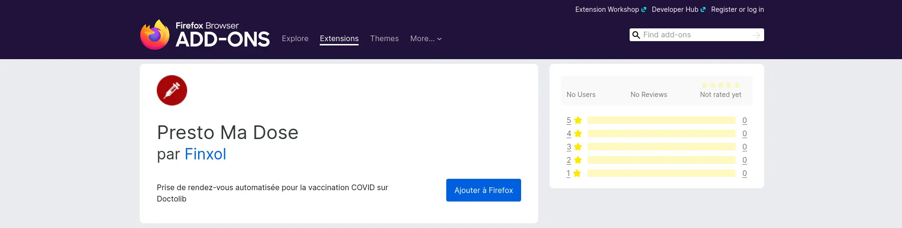
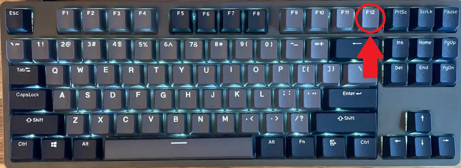
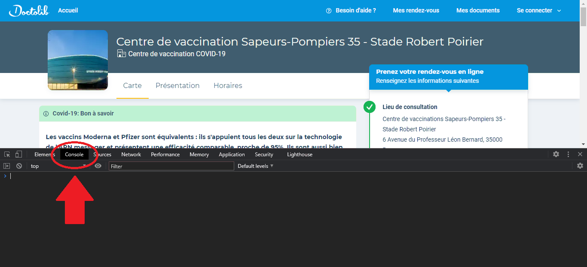
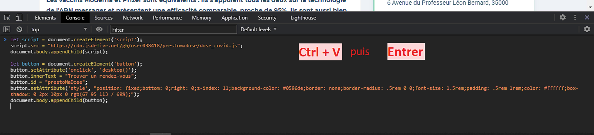

# Presto Ma Dose

[](https://github.com/user038418/prestomadose/releases)
[](https://www.gnu.org/licenses/gpl-3.0.fr.html)
[](https://github.com/user038418/prestomadose/issues)

Outil de recherche automatisée de rendez-vous pour la vaccination contre la COVID-19

Les rendez-vous sont cherchés directement sur le site de Doctolib pour éviter tout temps de retard

## Comment utiliser Presto Ma Dose ?

Les instructions ci-dessous permettront de créer un bouton sur le site Doctolib qui lance la recherche automatique de rendez-vous

### Sur Firefox

Une extension est disponible. Il vous suffit de l'installer pour utiliser Presto Ma Dose sur une page de reservation vaccination Doctolib.

1. **Installer l'extension**

   Aller sur [addons.mozilla.org](https://addons.mozilla.org/fr-FR/firefox/addon/presto-ma-dose/)
   et cliquer sur "Ajouter à Firefox"
   
   [](https://addons.mozilla.org/fr-FR/firefox/addon/presto-ma-dose/)

2. **Aller sur une page de centre de vaccination sur Doctolib**
   
   La zone de selection de date et de démarrage devrait apparaître en bas à droite sur la page

   N'oubliez pas d'autoriser les notifications

### Sur Chrome, Safari, Edge...
1. **Ouvrir la page Doctolib d'un centre de vaccination**

2. **Copier ce code et lancez-le dans la console :**
   
    [Comment utiliser la console ?](#comment-utiliser-la-console-)

    ```javascript
    (() => {
        let script = document.createElement('script');
        script.src = "https://cdn.jsdelivr.net/gh/user038418/prestomadose@v4.0/dose_covid.min.js";
        document.body.appendChild(script);
        script.onload = () => {
           let search = new Search();
           search.init();
        }
    })();
    ```

3. **Sélectionnez une date, cliquez sur "Trouver un rendez-vous" et attendez !**
   
   Il vous sera probablement demandé d'accepter les notifications, vous devrez alors cliquer sur "Autoriser"

### Démonstration :


### Comment utiliser la console ?

1. **Cliquer sur `F12`**
   
   

2. **Cliquer sur l'onglet console**
   
   

3. **Coller le code ci-dessus**
   
   Sur Firefox, il est nécessaire de suivre les instructions affichées pour pouvoir coller le code dans la console
   
   


----
### Package Extension

Dans le dossier, lancer :
```
zip -r -FS prestomadose-<version number>.zip dose_covid.js manifest.json img/icon.png
```
